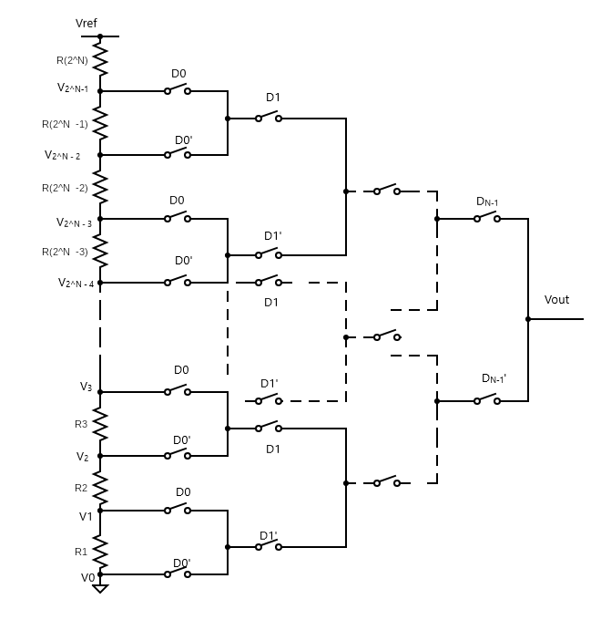

# Designing a Potetiometric DAC

This GitHub repository documents the design of a 10 Bit Potentiometric Digital Analog Converter. Uses SkyWater SKY130 technology and the help of simulation tools like eSim and Ngspice.

## Table of Contents
- [Introduction](#introduction)
- [Pre Layout Design and Simulation](#pre-layout-design-and-simulation)
  * [The Switch](#the-switch)
  * [2-bit DAC](#2-bit-dac)
  * [3-bit DAC](#3-bit-dac)
  * [4-bit DAC](#4-bit-dac)
  * [5-bit DAC](#5-bit-dac)
  * [6-bit DAC](#6-bit-dac)
  * [7-bit DAC](#7-bit-dac)
  * [8-bit DAC](#8-bit-dac)
  * [9-bit DAC](#9-bit-dac)
  * [10-bit DAC](#10-bit-dac)
 
# Introduction
DAC stands for Digital to Analog Converter. It is a system that converts a digital signal into an analog signal. A digital to analog converter takes in digital bits as input and converts it into a corresponding analog voltage.
An n-bit DAC takes an n-bit digital input and converts it into a corresponding analog voltage level for the reference voltage.

 
