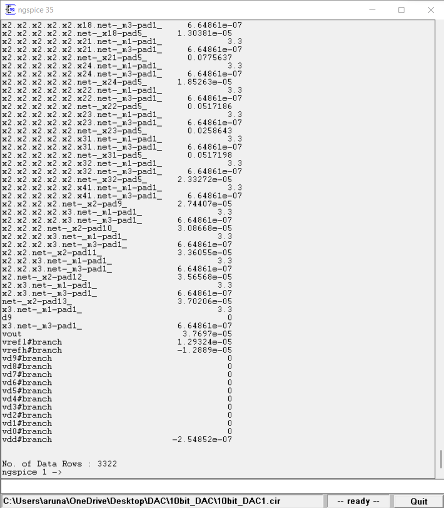

# Designing a Potetiometric DAC

This GitHub repository documents the design of a 10 Bit Potentiometric Digital Analog Converter. Uses SkyWater SKY130 technology and the help of simulation tools like eSim and Ngspice.

## Table of Contents
- [Introduction](#introduction)
- [Pre Layout Design and Simulation](#pre-layout-design-and-simulation)
  * [The Switch](#the-switch)
  * [2-bit DAC](#2-bit-dac)
  * [3-bit DAC](#3-bit-dac)
  * [4-bit DAC](#4-bit-dac)
  * [5-bit DAC](#5-bit-dac)
  * [6-bit DAC](#6-bit-dac)
  * [7-bit DAC](#7-bit-dac)
  * [8-bit DAC](#8-bit-dac)
  * [9-bit DAC](#9-bit-dac)
  * [10-bit DAC](#10-bit-dac)
 
# Introduction
DAC stands for Digital to Analog Converter. It is a system that converts a digital signal into an analog signal. A digital to analog converter takes in digital bits as input and converts it into a corresponding analog voltage.
An n-bit DAC takes an n-bit digital input and converts it into a corresponding analog voltage level for the reference voltage.

> Fig 1. Architecture of an n-bit DAC

# Pre Layout Design and Simulation

# Tools used:
- [eSim](https://esim.fossee.in/downloads)
- [ngspice](http://ngspice.sourceforge.net/download.html)
- [Skywater 130nm PDK](https://github.com/google/skywater-pdk)

## The Switch

> Fig.2  Schematic of the Switch circuit designed using eSim

> Fig. 3 Initializing transient analysis of the Switch circuit in pgspice 35

> Fig. 4 Transient Analysis of the Switch circuit 

From the output graph for the Switch circuit we can observe that the circuit is working as intended.
-------------------------------------------------------
## 2-bit DAC

> Fig. 5 Circuit schematic of a 2-bit DAC designed using eSim

> Fig. 6 pgspice command window running transient analysis for the 2bit_DAC

> Fig. 7 Transient analysis of the 2-bit DAC

Here we observe that the 2-bit didigtal input has been converted into its corresponding analog output.
We 2^2 = 4 steps in the analog output.

-------------------------------------------------------
## 3-bit DAC

> Fig. 8 Circuit Schematic of a 3-bit DAC designed in eSim

> Fig. 9 Simulation of the 3-bit DAC in pgspice

> Fig. 10 Transient analysis of the 3-bit DAC

Here we get 8 steps in the analog output as the system was given 3 digital input bits.

-------------------------------------------------------
## 4-bit DAC

> Fig. 11 Circuit Schematic of a 4-bit DAC designed in eSim 

> Fig. 12 Simulation of the 4-bit DAC in pgspice

> Fig. 13 Transient analysis of the 4-bit DAC

Here we get 16 steps in the analog output as the system was given 4 digital input bits.

-------------------------------------------------------
## 5-bit DAC

> Fig. 14 Circuit Schematic of a 5-bit DAC designed in eSim

> Fig. 15 Simulation of the 5-bit DAC in pgspice

> Fig. 16 Transient analysis of the 5-bit DAC

Here we get 32 steps in the analog output as the system was given 5 digital input bits.

-------------------------------------------------------
## 6-bit DAC

> Fig. 17 Circuit Schematic of a 6-bit DAC designed in eSim

> Fig. 18 Simulation of the 6-bit DAC in pgspice

> Fig. 19 Transient analysis of the 6-bit DAC

Here we get 64 steps in the analog output as the system was given 6 digital input bits.

-------------------------------------------------------
## 7-bit DAC

> Fig. 20 Circuit Schematic of a 7-bit DAC designed in eSim

> Fig. 21 Simulation of the 7-bit DAC in pgspice

> Fig. 22 Transient analysis of the 7-bit DAC

Here we get 128 steps in the analog output as the system was given 7 digital input bits.

-------------------------------------------------------
## 8-bit DAC

> Fig. 23 Circuit Schematic of a 8-bit DAC designed in eSim

> Fig. 24 Simulation of the 8-bit DAC in pgspice

> Fig. 25 Transient analysis of the 8-bit DAC

Here we get 256 steps in the analog output as the system was given 8 digital input bits.

-------------------------------------------------------
## 9-bit DAC

> Fig. 23 Circuit Schematic of a 9-bit DAC designed in eSim

> Fig. 24 Simulation of the 9-bit DAC in pgspice

> Fig. 25 Transient analysis of the 9-bit DAC

Here we get 512 steps in the analog output as the system was given 9 digital input bits.

-------------------------------------------------------
## 10-bit DAC

> Fig. 23 Circuit Schematic of a 10-bit DAC designed in eSim

> Fig. 24 Simulation of the 10-bit DAC in pgspice

> Fig. 25 Transient analysis of the 10-bit DAC

Here we get 1024 steps in the analog output as the system was given 10 digital input bits.

-------------------------------------------------------
